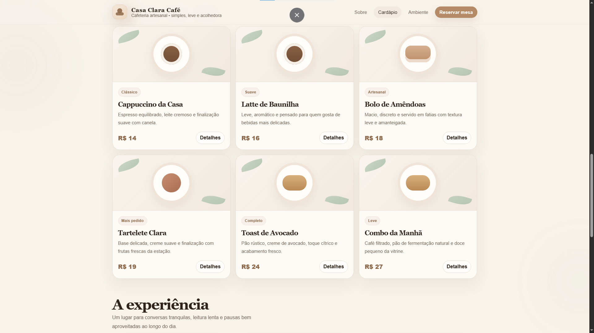

# Casa Clara Café - Landing Page

Projeto conceito de uma landing page para cafeteria, desenvolvido com HTML, CSS e JavaScript, com foco em visual claro, elegante e minimalista.

## ☕ Sobre o projeto

A proposta deste projeto é apresentar uma cafeteria fictícia chamada **Casa Clara Café**, valorizando uma identidade visual suave, acolhedora e sofisticada.

O site foi pensado para transmitir leveza e organização, com uma estrutura simples e bonita, destacando a marca, o cardápio, a proposta do espaço e a área de contato para reservas.

## ✨ Funcionalidades

- Layout responsivo
- Menu de navegação
- Seção principal com destaque visual
- Apresentação da cafeteria
- Cardápio com filtro por categoria
- Seção de experiência do ambiente
- Formulário de reserva
- Envio da reserva para o WhatsApp
- Animações sutis ao rolar a página

## 💻 Tecnologias utilizadas

- HTML5
- CSS3
- JavaScript

## 🎯 Objetivo

Este projeto foi desenvolvido como uma demonstração de landing page para um negócio local, com foco em estética, clareza visual e experiência agradável para o usuário.

## 🚀 Como executar

1. Baixe ou clone este repositório
2. Abra o arquivo `index.html` no navegador

## 📌 Observação

Este projeto é um protótipo funcional para portfólio e demonstração.

## 👨‍💻 Autor

divisasites